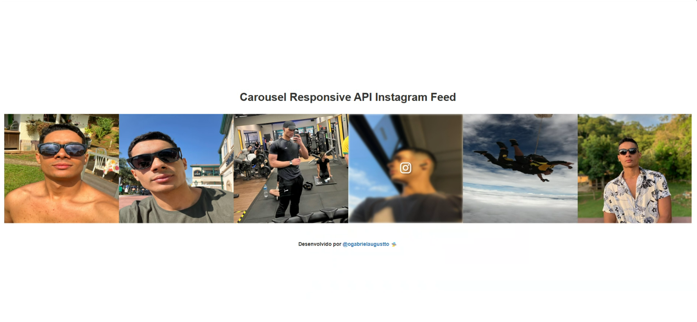

# Carousel Responsive Feed Instagram Using API Meta Developers

## Sobre o projeto 🎯

Desenvolvi este carrossel diante uma demanda que surgiu em um desenvolvimento de site. A cliente havia solicitado um carrossel trazendo os posts que estão no feed do Instagram da empresa. Encontrei algumas ferramentas e plugins na internet, mas todos são pagos, então fui lá e fiz um do zero.

O objetivo é simples, trazer os posts do Instagram, quando clicar levar para o post clicado. 

Atualmente este carrossel traz apenas, imagens, vídeos e álbuns. Não realizei a melhoria para trazer os Reels, mas fica como meta futura.

## 📫 Contribuindo para "Carousel Responsive Feed Instagram"

Para contribuir com projeto, siga estas etapas:

1. Bifurque este repositório.
2. Crie um branch: `git checkout -b <nome_branch>`.
3. Faça suas alterações e confirme-as: `git commit -m '<mensagem_commit>'`
4. Envie para o branch original: `git push origin <nome_do_projeto> / <local>`
5. Crie a solicitação de pull.

Como alternativa, consulte a documentação do GitHub em [como criar uma solicitação pull](https://help.github.com/en/github/collaborating-with-issues-and-pull-requests/creating-a-pull-request).

## 🤝 Colaboradores

Agradecemos às seguintes pessoas que contribuíram para este projeto:

<table>
  <tr>
    <td align="center">
      <a href="https://github.com/ogabrielaugustto" title="git-hub-gabriel-augusto">
         
        
          <b>Gabriel Augusto</b>
        
      </a>
    </td>

  </tr>
</table>

## 😄 Seja um dos contribuidores

Quer fazer parte desse projeto? Clique [AQUI](CONTRIBUTING.md) e leia como contribuir.

## 📝 Licença

Esse projeto está sob licença. Veja o arquivo [LICENÇA](LICENSE.md) para mais detalhes.